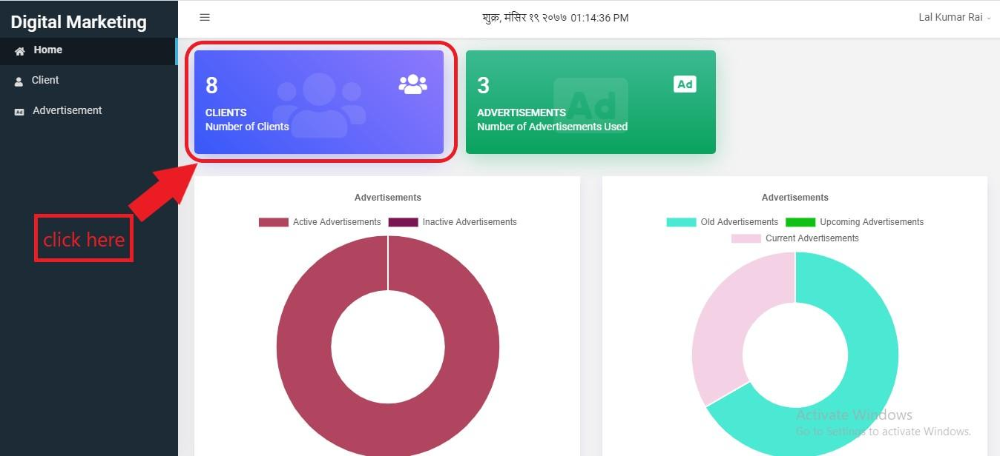
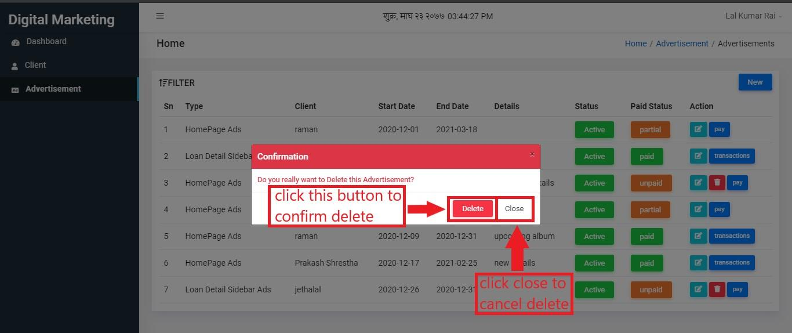

Advertisement Module
=====================

To enter into this module, the user has to click on the option shown below:

*Figure 6.1: enter advertisement module*

After entering, the user will be directed to the home page which looks like this:

*Figure 6.2: advertisement module*

Here, the user can also read details about advertisement in circular graph. Advertisement module has two sections. They are:

* Client
* Advertisement

Client
-------

Client is the one whose advertisement(s) is published or is to be published. To enter into this section, the user simply has to click on Client seen on sidebar.

*Figure 6.3: enter into client*

Alternatively, user can also click on blue colored big box shown below:

*Figure 6.4: enter into client*

Then the user will be landed on this page.

*Figure 6.5: clients table*

You can see some detail of clients in tabular form.

To add new client click on new button as shown below:

*Figure 6.6: add client*

Clicking on new button redirects the user on this page where the user has to fill client’s information. Name and Email are the must required field where Address and Contact No are optional.

*Figure 6.7: enter details*

When you enter all the details, click on submit button as shown below.

*Figure 6.8: submit details*

Now if you like to edit a client’s detail, you have to click on edit button.

*Figure 6.9: edit details*

After editing the details, you have to click on update button to update the client’s details.

.. image:: ./../../images/image298.jpg

*Figure 6.10: update details*

Advertisement
--------------

To get into this section, user can simply click on Advertisement in the sidebar shown below.

*Figure 6.11: enter advertisement*

Alternatively, user can click on green colored big box as well.

*Figure 6.12: enter advertisement*

User will be landed on the following page after entering advertisement section.

*Figure 6.13: advertisement table*

Owner of advertisement is client. So if the you have not created client details, you cannot create advertisement. Make sure you have created client whose advertisement you are going to create. To create advertisement, click on new button.

*Figure 6.14: add advertisement*

The user will be landed on form creation page where he/she has to fill details including Client, Start Date, End Date, Detail, Type, Image and Status. * fields are the required fields where user must input details.

*Figure 6.15: add details*

After entering details, click submit button to add new advertisement.

*Figure 6.16: submit details*

To edit details click the edit button of Action column.

*Figure 6.17: edit details*

The user will be redirected on edit page and now can edit information. After editing he/she has to click on update button.

*Figure 6.18: update details*

If the client wants to pay the amount for advertisement, the user has to click on pay button present on Action column.

*Figure 6.19: pay amount*

Then the user will be landed on the following page where he/she has to input amount and method of payment. After entering inputs, the user can click on submit button.

*Figure 6.20: submit cash payment*

If the client likes to do payment in cheque, then details including bank name, cheque number and date also must be given.

*Figure 6.21: submit cheque payment*

To view transaction detail you can simply click on transaction button.

*Figure 6.22: view transaction*

The transaction detail includes client name, amount of payment, payment method and date of payment. The page that shows transaction details look like this:

*Figure 6.23: transaction detail*

Finally to delete the advertisement detail, you can simply click on delete button of action column shown below.

*Figure 6.24: delete advertisement*

A confirmation box will appear. If you are confirm to delete that advertisement, you can click on Delete button. Otherwise you have to click on close.

*Figure 6.25: confirm delete*