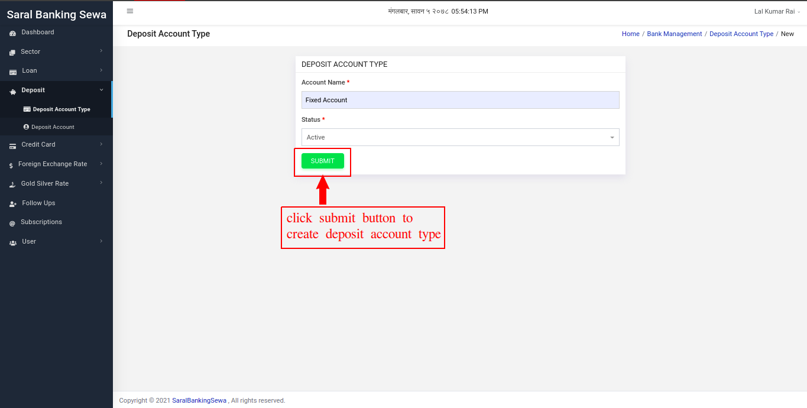
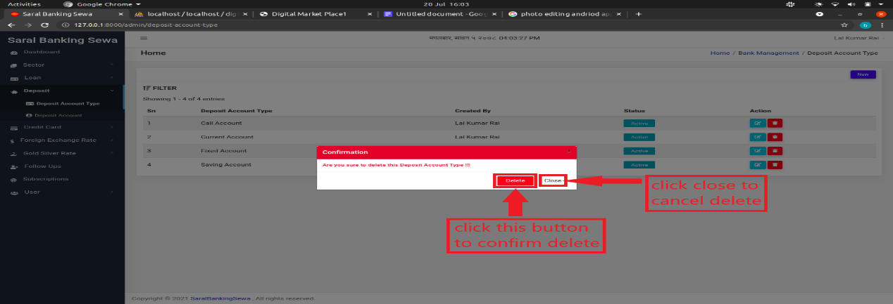
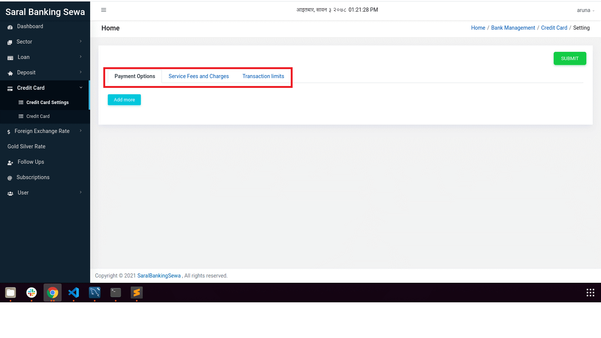
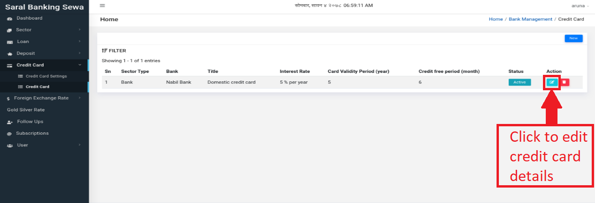
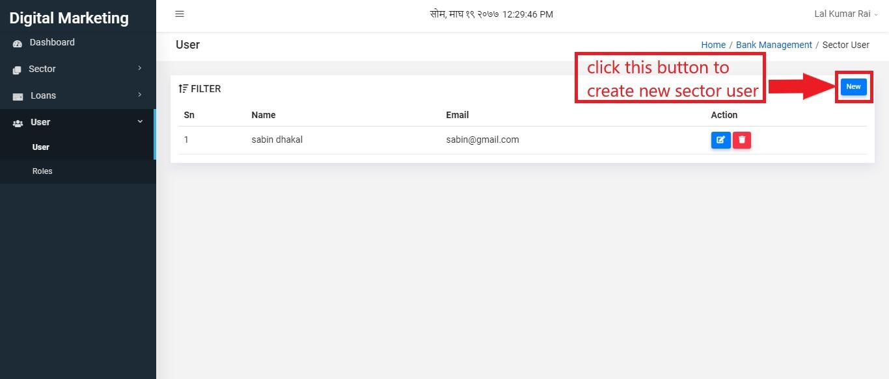
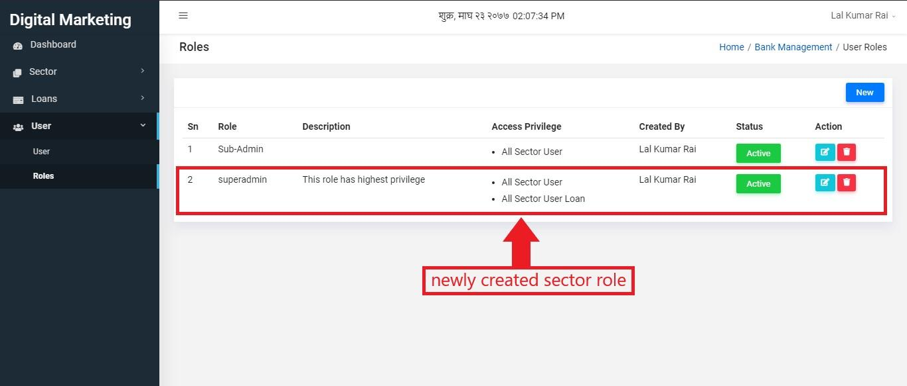
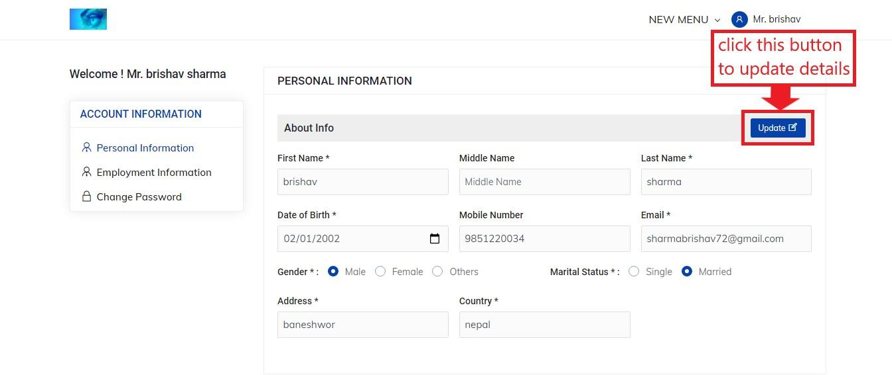
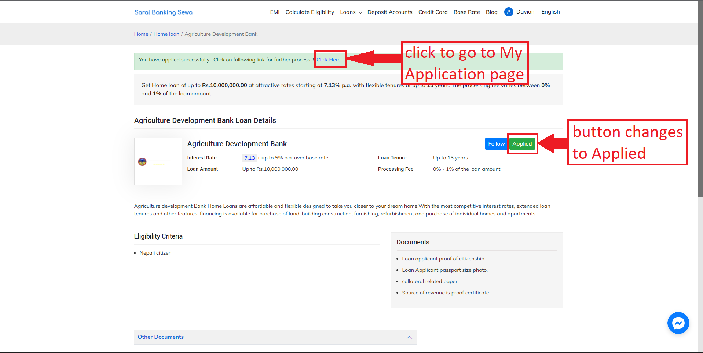

Bank Module
===========

When user signs in, he/she can enter into bank module by clicking the option shown below:

*Figure 3.1: enter bank module* 

Figure 3.1: enter bank module

When you enter this module, you will be redirected to the home page which will look like this:

*Figure 3.2: bank module*

When you scroll down to this page you can see graph that shows interest rate for loans in different sectors.

*Figure 3.3: bank module*

Bank module consists of two sections. They are:

* Sector
* Loans

Sector
------

If you look at the sidebar, you can find sector below home. Click on it that will slide down with two options:-

* Sector Type
* All Sectors

*Figure 3.4: click sector*

*Figure 3.5: sector slidedown*

Sector Type
^^^^^^^^^^^^

Sector Type may be bank, finance, insurance,etc. To enter this section, user can click on sidebar or red colored box as shown below:

*Figure 3.6: click options*

Then the user will be landed on this page:

*Figure 3.7: sectortype table*

Now to create sector type, click on New button as shown below:

*Figure 3.8: click new*

After clicking on new button user will be redirected a page where he/she has to input name and status.

*Figure 3.9: create sector type*

When the user fills the form, he/she can submit it by clicking submit button:

*Figure 3.10: submit form*

The new sector type will be created and you can see it in tabular form asn below. If the user thinks to edit the details, he/she has to click on edit button present on Action column.

*Figure 3.11: edit details*

It will land you on update page:

*Figure 3.12: change details*

If the user has changed details, he/she can click on update button.

*Figure 3.13: update details*

Sector
^^^^^^^

It is another section where all the sectors are manipulated. User can click on ’All Sectors’ of sidebar or green colored box present at home page.

*Figure 3.14: click options*

After entering this section the user will be landed on following page:

*Figure 3.15: all sectors*

Now to create new sector you have to click on new button.

*Figure 3.16: create sector*

Then the user will be redirected to form creation page will looks like this:

*Figure 3.17: sector form*

User has to fill the form with necessary details. Red colored astrick fields are those fields which must be filled. When user completes filling the form, he/she can click submit button present below.

*Figure 3.18: submit form*

New sector will be created which you can see on sectors page in tabular form. Also user can edit sector details by clicking on edit button present on Action column.

*Figure 3.19: edit sector*

User can make changes on edit page and simply click on update button to submit changes.

*Figure 3.20: update sector*

Loans
------

Loan is a thing that is borrowed, especially a sum of money that is expected to be paid back with interest.

To enter into this section, user can click on link present on sidebar:

*Figure 3.21: loans link*

When the user clicks on that link, two menus of loan with slide down which are:

* Loan type
* All loan

*Figure 3.22: loan links*

Loan Type
^^^^^^^^^^

User can create and edit loan types by clicking on the loan types link. User can then create a new loan type by clicking on the new button.

*Figure 3.23: Loan type link*

After clicking on new, user will be redirected to create new loan type form. User can then fill the details and click on submit to create a new loan type.

*Figure 3.24: Create new Loan type form*

The newly created loan type will be then shown in the Loan type page.

To edit the loan type user can click on the edit button.

*Figure 3.25: Edit loan type*

After clicking on edit button, user will be redirected to edit loan type page where they can edit the details of the loan type.

*Figure 3.26: loan detail*

Red colored astrick(*) fields are necessary to be filled. When user completes this form, he/she can click on update to update the details of loan type.

User can delete the loan type by clicking on delete button.

.. image:: ./../../images/image132.png

*Figure 3.27: Delete button*

After clicking on delete, the user will get a confirmation box. The user can delete the loan type by clicking on delete or cancel by clicking on cancel button.

.. image:: ./../../images/image129.png

*Figure 3.28: Delete confirmation*

All loans
^^^^^^^^^^

User can see all the entered loans by clicking on the all loans link.

User can then create a new loan by clicking on the New button.

*Figure 3.29: Create New loan*

After creating new loan, user will be redirected to the form for creating new loans.

*Figure 3.30: Create New loan Form*

Red colored astrick(*) fields are necessary to be filled. When user completes this form, he/she can click on next page, i.e. Service Features:

*Figure 3.31: Service features link*

Service Features would appear like this: Here you can see features like What You Love,

Documents, Think About, Fee and Charges, Eligibility Criteria and Perks. You can add any or all of them as per detail the sector possess. For example if you like to add What You love then firstly, you have to select it. Selecting What You Love makes it appear below the page like this:

*Figure 3.31: Service features*

Likewise, you can add any other service feature you want.

The next subsection here is other features. Click on Other Features tab next to Service Features to add other features not present in service features.

.. image:: ./../../images/image51.png

*Figure 3.32: Other Features*

The next subsection is SEO details.

*Figure 3.33: SEO details*

And the final section is meta tags section. In this section, user can add, delete and modify meta tags.

*Figure 3.34: Meta tags*

When all the inputs are given, it’s time to submit the form. User has to click on submit button to submit the details.

*Figure 3.35: submit form*

On right side of the Detail tab, you can see Log tab. Click on it to view loan log details.

*Figure 3.35: Loan Log tab*

You can view loan log details in tabular form with minimum interest rate, maximum interest rate, minimum processing fee rate, maximum processing fee rate, minimum loan amount, maximum loan amount, minimum tenure range and maximum tenure range. Additionally, you can see who has updated those details and at what time.

User can edit the loan details by clicking on the edit button. After clicking on it, the user is redirected to the loan detail form.

*Figure 3.38: edit loan details*

The user will be directed on edit page. The way to edit loan details would be same as to create loan details.

*Figure 3.39: update loan details*

The user can also delete loan details. To perform such operation, he/she has to click delete button present on Action column next to edit.

*Figure 3.40: delete loan details*

Clicking on delete button produces a confirmation box. The user again has to click on delete button if he/she is sure to delete that loan detail. Otherwise he/she can click on close.

*Figure 3.41: confirm delete*

The way to do create, read, update and delete for all other six types of loan i.e. home loan, education loan, short-term loan, two wheeler loan, car loan and used car loan is same as that of personal loan.

Loan Application
^^^^^^^^^^^^^^^^^^

The loan applications after proceeding will be displayed under the Loan Application link. 

*Figure 3.42: Loan Applications link*

The Loan Applications page contains the list of all the applied loans by the users. The Loan Applications page looks like this:

*Figure 3.43: Loan Applications page*

In the Loan Applications page, the details of the applied loans are displayed such as Customer, Bank, Loan, Status and Action.

The user can change the status of the loans by clicking on the eye button under Action.

*Figure 3.43: Change Loan Application status*

The update page shows the details of the loans and the Customer along with all the documents and files submitted.

The user can change the status of the loan by clicking on the Update button. After clicking on the update button, a drop down list will appear. The user can select the appropriate status and click on Update button to update the status of the loan.

*Figure 3.44: Update Loan Application status*

Deposits
---------

Under the loan section in bank sidebar, the user can see a section, called deposit. Click on it to view its sub sections.

*Figure 3.42: Deposit Link*

When the user clicks on deposit, it drops down with two sub sections:

* Deposit Account Type
* Deposit Account.

*Figure 3.43: Deposit menus*

Deposit Account Type
^^^^^^^^^^^^^^^^^^^^^

To create any deposit account, deposit account type must be created at first. The user has to click on deposit account type to enter into it.

*Figure 3.44: Deposit Account Type Link*

The user will be landed on listing page which would look like this:

*Figure 3.45: Deposit Account Page*

Now to create a deposit account type, the user must click on new button on top right of the page.

*Figure 3.46: New Deposit Account type*

Clicking on new button will redirect a user to deposit account type create page.

*Figure 3.47: Create Deposit Account Type form*

Here, the user has to input account name and the status. There are mainly four deposit account types. They are as follows:

* Saving Account
* Fixed Account
* Current Account
* Call Account

The system user must input account name with any of above four types without making spelling mistake. After entering account name and selecting status, the user can click on submit button.

*Figure 3.48: Submit Deposit Account Form*

  

Newly created deposit account type can be seen on listing page at the top of the table.

*Figure 3.49: Newly Created Deposit Account Type*

The user can also edit the deposit account type details. To do it, he/she has to click on edit button on the row at the last column.

*Figure 3.50: Edit Deposit Account Type*

After clicking on edit button, the user will be landed on edit page which would be similar to that of create page.

*Figure 3.51: Edit Deposit Account Type Details*

The user can make necessary changes and click on update button to update details.

*Figure 3.52: Update Deposit Account Type Details*

The deposit account type can be deleted as well. To do so, the user has to click on delete button which is placed next to edit button.

*Figure 3.53: Delete Deposit Account Type*

Once the delete button is clicked, a confirmation box will appear. If the user actually wants to delete that deposit account type, he/she can click on delete button. Otherwise clicking on close button would be the right choice.

*Figure 3.53: confirm delete*

Deposit Account
^^^^^^^^^^^^^^^^

Deposit account of a sector is actually created in this sub section. To enter into this section, the user has to click on deposit account which is located below deposit account type.

*Figure 3.54: Deposit Account Link*

Clicking on deposit account will land user to the listing page which would look like this:

*Figure 3.55: Deposit Account page*

Now to create a new deposit account, user has to click on new button which is present at top right of the page.

*Figure 3.56: New Deposit Account Link*

The user will be redirected to the following page:

*Figure 3.57: Create New Deposit Account Page*

There are multiple tabs in this page which includes Deposit Account Detail, Documents, Features and Meta Tags. Deposit Account Detail tab will be active at first and so its content will be seen. There are some required fields in this tab that the user has to fill. After filling details in this tab, the user can switch to Documents tab to input some required document details. He/she simply has to click on Documents tab.

*Figure 3.58: Documents tab link*

Clicking on Documents tab will switch the user to documents tab. The user can see add more button there. To add new point, the user has to click on it.

*Figure 3.59: Add more Documents*

Clicking on add more button make a input box appear where the user can fill a point.

*Figure 3.60: Add more Documents*

The user can add as much points as he/she wants to.

The user can also delete a point if he/she likes to. To do it, the user can simply click on delete button located at right side of each input field.

Another tab is Features tab where the user can put some feature points as same as that in Documents tabs. For that, he/she can click on Features tab.

*Figure 3.62: Features Tab*

Clicking on Features tab will switch the user to Features tab where he//she has to click on add more button to add new feature.

*Figure 3.63: Add more features*

The input box will appear for inputting feature point which would be same to document input field.

.. image:: ./../../images/image326.png

*Figure 3.64: Enter new features*

The user can add as much point as he/she wants. 

The user can also delete a feature point. He/she can click on delete button for it.

*Figure 3.65: Delete Features*

There is a last tab, called Meta Tags. Meta tag informations are added there. To navigate on that tab, the user has to click on Meta Tags tab.

*Figure 3.66: Meta Tags tab*

To add meta tags, the user must click on add more button.

*Figure 3.67: Add more meta tags*

There are three input boxes in this tab. The user has to select name, input title and input value. Infinite number of meta tags can be created. The user can also delete a meta tag by clicking on delete button.

*Figure 3.68: Delete Meta tags*

After inputting necessary fields in all tabs, user can click on submit button to submit details about a deposit account.

*Figure 3.69: Submit Deposit account details*

 

Newly created deposit account will appear on listing page at top of the table.

*Figure 3.70: Newly Created Deposit Account*

The created deposit account can be edited as well. To edit a deposit account, the user must click on edit button.

*Figure 3.71: Edit Deposit Account*

The edit page would be same as that of create page. The difference is, while editing the input fields will be filled with previously filled data.https://lh4.googleusercontent.com/QmL_1JreRDaye_n_IlPhREybR9lETF_PmnUu7_i3l0bLdh0Tpy7O99t5WkpRNbKvdF93DBjhJ-RxLLPvj3y-BGp0mjFaFkT0nL9VVehgX8dT1kdpCOaTeWHR-s8udgHdclqphfc

*Figure 3.72: Update Deposit Account*

Here the user can change the details in each tab. To change documents, user can switch to Documents tab by clicking on it. To change features, user can to switch to Features tab by clicking on it. Similarly, to change meta tags, user can switch to Meta Tags tab by clicking on it.

*Figure 3.73: Edit Deposit Account tabs*

Additionally, the user can view deposit account log detail by clicking on Log tab located next to Detail tab.

*Figure 3.74: Deposit Account Log*

The log tab looks like this:

*Figure 3.75: Deposit Account Log page*

The user can view the date of update and also the value in each column.

If the editing of values has been completed, the user can click on update button in Detail tab to update deposit account details.

*Figure 3.76: Update Deposit Account*

The user can delete a deposit account. To do so, the user has to click on delete button which is present next to edit button.

Once the delete button is clicked, a confirmation box will appear where the user has to confirm delete. If the user is sure to delete it, he/she can click on delete button. If not sure, then clicking on close button would be the right choice.https://lh6.googleusercontent.com/jirvIS2gq4mdVXAUGxDbTGwsjFPp74G80Qs5yalrUNZO-Q3ly8vOf23m5sZ4pJ5t8FdJajQVCFXAm0FnKQVCnYXXm_v-4vX47LOSeBMl-B709DMBL-AaTihRfHNXGPx5HAwHZMI

*Figure 3.78: Confirm Delete*

Credit Card
---------------

Credit Card Settings
^^^^^^^^^^^^^^^^^^^^^

Go to bank module, and you will see credit card in the sidebar.

*Figure 3.31 Credit Card Link*

 At first you have to add data for payment options, transaction limits and service fees in credit card settings. So click on credit card settings

*Figure 3.42: Credit Card Settings Tabs*

Add necessary data in payment options, service fee and charges and transaction limits respectively and submit

*Figure 3.43: Filling data in Transaction Limits in Credit Card Settings*

*Figure 3.44: Filling data in Service Fees and Charges*

*Figure 3.45: Filling data in Transaction Limits*

Credit Card
^^^^^^^^^^^^

Click on credit card in sidebar, It will land on credit card page. Where list of credit card details is shown

*Figure 3.46: Credit Card listing page.*

Click on new button on the right side to add new credit card detail, you will land on this page

*Figure 3.47: Credit Card form*

Add credit card details like bank name, credit card title, interest rate, validity period, description etc. as shown in image.

Click on next tab Service fee and charges, here add service and fees details with amount

*Figure 3.48: Service fees and Charges*

Next tab is transaction limits, here also add transaction limit details of the credit card

.. image:: ./../../images/image232.png

*Figure 3.49: Transaction Limits in Credit Card form*

Next is service features, here you can add other details listed below

*Figure 3.50: Service Features*

Next tab contains other features, here you can add any descriptions for the credit card by adding add title button

.. image:: ./../../images/image220.png

*Figure 3.33: Other features tab*

After filing all data, click on submit button

To update data, go to credit card page and click on edit icon

*Figure 3.33: Credit Card Edit*

*Figure 3: Action Buttons*

And this will land on edit page of respective credit card, make your changes and click on update.

 
*Figure 3.33: Credit Card Edit details*

To delete credit card detail, click on delete icon and a popup will appear, then click on delete.

*Figure 3.33: Credit Card delete confirmation*

User
-----

User is the system operator of a sector. To create sector user with some roles, user has to enter this section. Click on User present at sidebar below laons.

Figure 3.42: user

It will slide down with two subsections:

User
Roles

User
^^^^^

This subsection deals with sector user. User can click on it to enter into it.

*Figure 3.43: user subsection link*

User will be landed to the following page.

*Figure 3.44: sector user table*

In this page, we can see sector users’ detail in a tabular form. Now to create a new user, click on New button.

*Figure 3.45: create new sector user*

Clicking on new button will redirect the user to this page:

*Figure 3.46: sector user form*

Fields with astricks(*) are the required fields. So those fields are necessary to be filled with input values. After filling all details, user can click on submit button.

*Figure 3.47: sector user form submit*

Newly created sector user can be seen on tabular form in user page.

*Figure 3.48: newly created sector user*

To edit sector user details, the user can simply click on edit button.

*Figure 3.49: sector user edit*

The user will be landed to the edit page.

*Figure 3.50: sector user details edit*

Here the user can do some changes. Then click on update button below to update details.

*Figure 3.51: sector user details update*

To delete sector user, click on delete button.

*Figure 3.52: sector user delete*

It will make a confirmation box appear at the middle of the page. If you are sure to delete, you can click on Delete button. Otherwise click on close.

*Figure 3.53: sector user confirm delete*

Roles
^^^^^^

Roles can be provided to sector user. Below user, there is roles. Click on it to enter into it.

*Figure 3.54: sector user role*

The user will be landed to the following page where role details can be seen in tabular form.

*Figure 3.55: sector user roles*

To create new role user can click on new button.

*Figure 3.56: new sector user roles*

Clicking on new will land user to the following page.

.. image:: ./../../images/image152.jpg

*Figure 3.57: new sector user role form*

Now user has to fill title, description, access by and click on some privileges. Then user can click on submit button.

.. image:: ./../../images/image161.jpg

*Figure 3.58: sector user role form submit*

Newly created sector user role can be seen on tabular form in sector roles page.

*Figure 3.59: sector user role created*

Sector user roles can be edited. To edit, click on edit button.

.. image:: ./../../images/image146.jpg

*Figure 3.60: sector user role edit*

The user will be landed to edit page where he/she can do changes on titles, description and privileges and click on update button to update sector role.

*Figure 3.61: sector user role update*

Sector user role can also be deleted. But if some user has that role, you cannot delete it. You can delete a role only if it is not associated with some users. To delete a role click on delete button.

*Figure 3.62: sector user role delete*

Clicking on delete button will pop up a confirmation box. To confirm delete, click on Delete button and to abort delete, click on Close.

*Figure 3.63: sector user role delete confirm*

Foreign Exchange Rates
-----------------------

This is the section for foreign exchange rates. User can create and edit the foreign exchange rates in this section.

*Figure 3.63: Foreign Exchange rates link*

It will slide down with two subsections:

* Foreign Exchange Rate
* Logs

Foreign Exchange rates
-----------------------

Foreign Exchange Rates page can be accessed by clicking on the Foreign Exchange Rates link.

*Figure 3.64: Foreign exchange rates link*

After clicking on the link, we are directed to the foreign exchange rates page. This page displays the icon, currency, code, buying and selling rate, status and the action buttons of the existing foreign exchange rates.

*Figure 3.65: Foreign exchange rates page*

Click on the New button to create new foreign exchange rate.

*Figure 3.66: Create new Foreign exchange rate*

After clicking on new, we land on the following page.

*Figure 3.66: New Foreign Exchange Rate Form*

Now user has to fill the currency, code, unit, buying rate, selling rate, status and icon of the new foreign exchange rate. Then the user can click on submit button.

*Figure 3.67: New Foreign Exchange Rate Form Submit*

After clicking on submit, the new foreign exchange rate is displayed in the foreign exchange rate page as follows.

*Figure 3.68: New Foreign Exchange Rate created*

The user can edit the existing currencies by clicking on the edit button.

*Figure 3.68: Edit Foreign Exchange Rate*

After clicking the edit button, user will land on the form for foreign exchange. The user can edit the desired details and click on update button to update the changes.

*Figure 3.68: Update Foreign Exchange Rate*

To delete an existing currency, user can click on the delete button shown below.

*Figure 3.68: Delete Foreign Exchange Rate*

Clicking on delete button produces a confirmation box. The user again has to click on

delete button if he/she is sure to delete that foreign exchange rate. Otherwise he/she can click on close.

*Figure 3.68: Delete Foreign Exchange Rate*

Foreign Exchange Rate Log
^^^^^^^^^^^^^^^^^^^^^^^^^^

The user can view the foreign exchange rate logs by clicking on the log button. It displays all the activities performed in Foreign Exchange Rate.

*Figure 3.68: Foreign Exchange Rate Log*

Customer
---------

For a customer to get logged-in, he/she has to navigate to home page of this website and click on login present at the navbar.

*Figure 5.1: customer login link*

Customer login page look like this:

*Figure 5.2: customer login page*

Customer can login to the system by entering his/her email address and password. But if he/she has not created an account, he/she can simply click on ’Register Here’ link.

*Figure 5.3: customer register link*

The customer register page looks like this:

*Figure 5.4: customer register*

In this page, the customer has to provide his/her details where firstname, lastname, email, address, gender, marital status, dob(date of birth) and password are the must. He/she can click on Sign Up button after entering necessary details.

*Figure 5.5: customer sign up*

Now the customer can do login through login page entering the link provided above in browser url bar.

To login into the system the customer has to enter his/her email address and password as provided in customer register page. After entering them click on Log In button.

*Figure 5.6: customer login*

Customer home page looks like this:

*Figure 5.7: customer home page*

If we look at sidebar, we see Account Information and inside it we have personal information, employment information and change password.

*Figure 5.8: Account Information*

Personal Information
^^^^^^^^^^^^^^^^^^^^^

The customer can view his/her personal information by clicking on personal information present at sidebar inside Account Information.

*Figure 5.9: customer personal information link*

Alternatively, you can click on your name present at navbar and then click on ’My Profile’.

*Figure 5.10: alternative customer personal information link*

Clicking on personal information link will land the customer to the following page.

*Figure 5.11: customer personal information*

Here the customer can view his/her details. To edit the details, he/she can click on edit button.

*Figure 5.12: edit button*

Now he/she can edit the details. To update it, the customer must click on update button.

*Figure 5.13: customer personal information update*

Employment Information
^^^^^^^^^^^^^^^^^^^^^^^

The customer can be an employee of a company. He/she can also view his/her employee details by clicking on employment information which is present below personal information inside account information.

*Figure 5.14: customer employment information link*

Clicking on employment information will land the customer to the following page.

*Figure 5.15: customer employment information*

To edit employment information he/she has to click on edit button.

*Figure 5.16: edit button*

Now the customer can do some changes there and click on update button.

*Figure 5.17: customer employment information update*

Change Password
^^^^^^^^^^^^^^^^

The customer can change his/her account password. To do so, he/she has to click on change password link below employment information inside account information.

.. image:: ./../../images/image339.jpg

*Figure 5.18: change password link*

The change password page looks like this.

*Figure 5.19: change password*

To change password, the customer has to enter his/her existing password, new password and re-enter password. The existing password must match with old password and the re-enter password must match with new password. After entering these three fields, the customer can click on update password button.

*Figure 5.20: change password update*

My Application
^^^^^^^^^^^^^^^

The user can apply for a loan by clicking on the Apply Now button in the loan details page.

*Figure 5.21: Apply loan*

After clicking on the Apply Now button, if the user is signed in, the Apply Now button will change to green and the button will be displayed as Applied. The user can also click on Click here button to go to the My Application page. After applying for the loan, the user is also notified via email about the loan applied.

*Figure 5.22: Applied*

If the user is not signed in, a Log In popup will appear. The user will have to enter the email and password and sign in in order to apply for the loan.

*Figure 5.23: Log In pop up*

If the user is not registered, they can click on the Register Now button to register. The user can click on the Forgot Password link if he/she has forgotten their password.

 After the user clicks on the Click Here link, the user is redirected to the My Application page.

.. image:: ./../../images/image336.png

*Figure 5.24: My Application Page*

In the My Application page, the loans which the user has applied for are displayed.

The details like Bank Name, Loan type, Date applied, Status of the application and Action to be performed on the loan is displayed.

Users can view and edit additional information of the applied loan by clicking on the eye button under Action.

*Figure 5.25: View and edit additional information*

The information page looks like this:

*Figure 5.26: Applied Loans Information*

The user can click on the Go Back button to go back to the all applied loan details page.

If the user wants to cancel the application, they can click on the Cancel Application button.

*Figure 5.27: Go Back and Cancel Application buttons*

After clicking on the Cancel Application button, the status of the loan is changed from Pending to Canceled and the user is redirected to the My Application page. The user is also notified via email about the canceled

*Figure 5.28: Canceled loan application.*

If the user wants to process for the loan, the user must fill the details in the loan application details page. The fields marked with asterisk (*) are mandatory whereas other fields are optional.

*Figure 5.29: Submit Loan application*

If all the details are valid, the loan application details will be submitted. A pop up message will appear confirming that the loan has been applied successfully.

A Proceed button will appear next to Go Back.

*Figure 5.30: Proceed*

After clicking on Proceed, the loan details will be submitted for further processing, the status of the loan will change to Processing. The user will also be notified via email that the loan has been applied for processing.

The details will be reviewed by the loan processing team in the backend and will be approved or disapproved based on the information provided.

Logs
""""""

The loan processing logs can be viewed by clicking on the Logs tab.

*Figure 5.31: Logs link*

After clicking on the Logs link, the logs of the user’s activities will be displayed. The logs page looks like this:

*Figure 5.32: Logs page*

My Search
^^^^^^^^^^

The My Search page displays all the loans visited by the user. To enter the My Search page, users can click on the My Search link.

*Figure 5.33: My Search link*

The My Search page displays the information about the bank loans visited which includes Bank Name, Loan and Date visited. The My Search page looks like this:

*Figure 5.34: My Search page*

Required Documents
^^^^^^^^^^^^^^^^^^^

The Required Documents page can be entered by clicking on the Required Documents link.

*Figure 5.35: Required Documents link*

In this page, the user can submit all the required documents for loan processing. It is an extension of the personal information page. In this page, the user can submit all the further documents required by uploading files and filling out the information in the form. The required documents page looks like this:

*Figure 5.36: Required Documents link*

