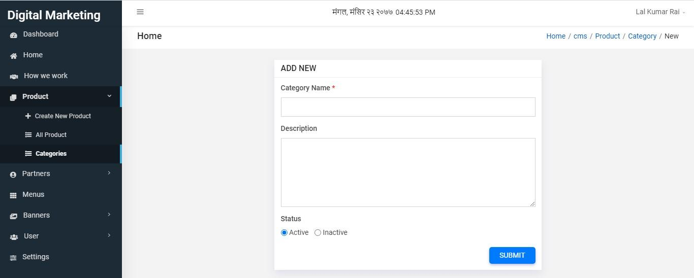
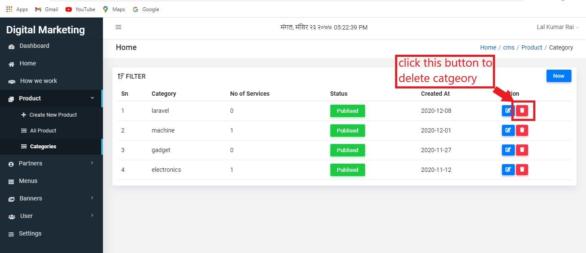
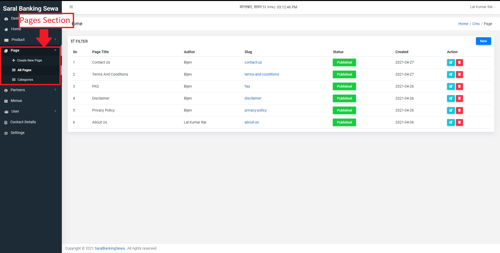
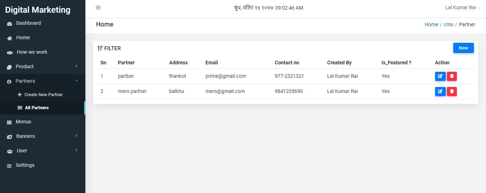
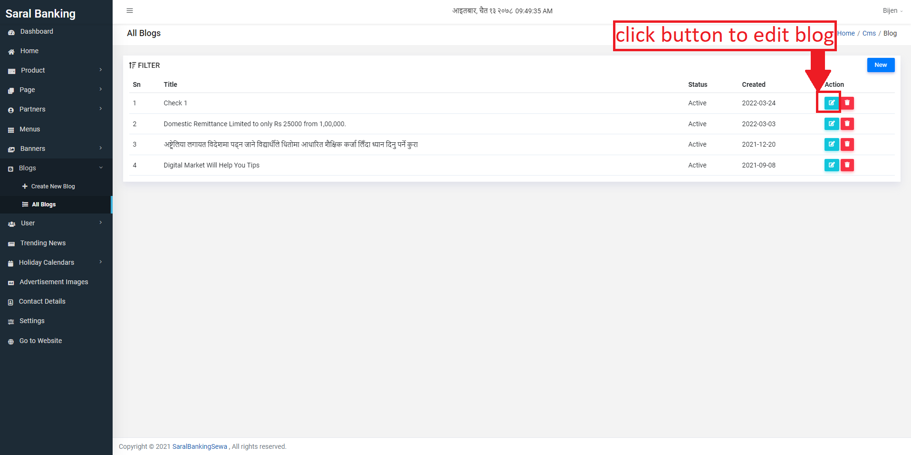
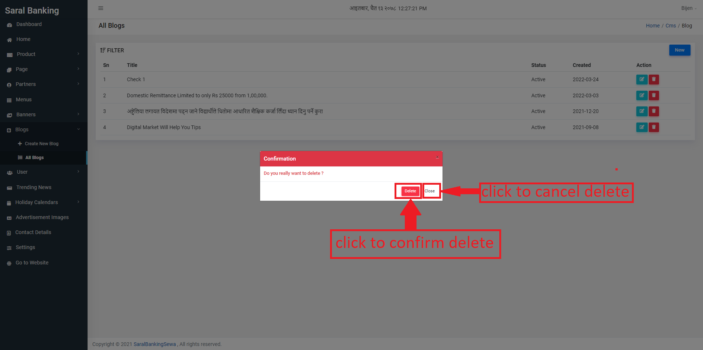
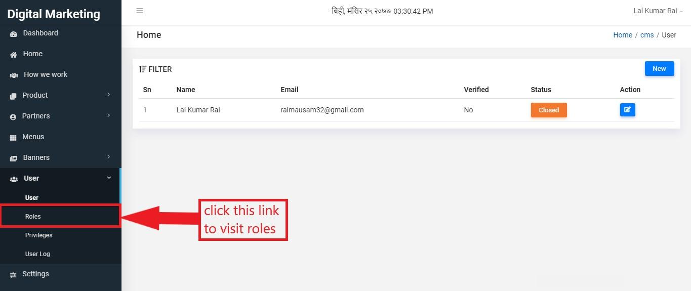

Cms Module
===========

It is the module where user can create and manage content. Those contents are used in this system. The contents that are created here will be rendered in frontend of the application.

To enter into cms module, user has to click on CMS Module as shown below:

Clicking on CMS Module will land user to the following page:

You can see some links on sidebar in which Dashboard is selected by default. The dashboard page has four titles Banners, Trending Products, Partners and Services. This manual instructs how to operate on each sections in detail.

Below the Dashboard, there is Home. You can click on it to visit home page.

Home page looks like this:

Figure 2.4: home page

CMS Module has seven sections. They are as follows:

* Product
* Partners
* Menus
* Banners
* User
* Settings

Product
--------

To visit product, you can click on Product link present on sidebar.

Clicking on product slides down with two subsections, All Product and Categories.

You can click on All Product to view product details. You can also see Create New Product above it. But before creating new product, you should create category.

Categories
^^^^^^^^^^^

Category is something that the product belongs to. To visit categories, click on it.

When the user clicks on categories, he/she will be landed on the following page where categories are listed in tabular form:

Now to create new category click new button.

User has to fill form with some details. The form looks like this:

In the form, user must enter category name. Description is optional and select status.

To edit a category click on edit button present on Action column.

The update page will appear and user can edit details now. After making some changes, he/she can click update button.

Figure 2.22: update category

The user can also delete any category. For that operation, he/she has to click delete button which is present next to edit button.

Clicking on delete button makes confirmation box appear at the middle of the page. User has to click on Delete button to actually delete category. Otherwise he/she can click close button.

All Product
^^^^^^^^^^^^
To visit all product, you can simply click on All Product link.

If you click on All Product link, you will be directed on all product page. You can see products in tabular form if they exists.

Now to create new product, user can simply click on new button.

Alternatively you can click on Create New Product link of sidebar.

Product creation page will be like this:

Here, Product Title and Category are the required fields. So the user must enter values in those fields. User can enter values in other fields as per his/her wish. After filling this form, user must add image by clicking on Add Feature Image present next to Product Content.

.. image:: ./../../images/image8.jpg

After adding feature image, user can add seo details by clicking on Seo Details tab.

If the form fill-up process has finished then you can either draft the product or publish the product. To draft the product click on DRAFT button. To publish the product click on PUBLISH button.

The created product will appear in tabular form in all product page. Now to edit product user can click on edit button present on Action column.

The edit page will be same as create page. You need to enter Product Content in which Product Title and Category is the must required. Then you can shift to change feature image. You can also change seo details by clicking on its tab right to Add Feature Image. At last, click on DRAFT button to draft the product or PUBLISH button to publish the product as per your specification.

To delete the product, user can simply click on delete button present next to edit button.

Pages
--------

User can create pages and edit them by selecting the Pages section.

When the user clicks on the Pages link, the menu slides down and shows three sections:

* Create New Page
* All Pages
* Categories

User can create a new page by clicking on the Create New Page link.

The Create New Page form consists of five tabs:

* Page Content
* Add Feature Image
* Add Icon
* Add SEO details
* Meta Tags
* Accordions

User can edit existing pages by clicking on the edit button.

After editing user can click on publish to update the details of the page.

User can delete the pages by clicking on the delete button.

After pressing delete button user will be shown a modal box with two options, delete and cancel. User can click on delete to delete the page and click on cancel to cancel delete.

Categories
^^^^^^^^^^

User can also view and create new categories by clicking on the Categories link just below all pages.

After clicking on New, user will be directed to create new category form. User can fill the details and lick on submit to create a new category.

After clicking on submit, the new category will be shown in the listing page.

User can click on edit button to edit category.

After editing the details, user can click on submit to update the details of category.

User can delete category by clicking on delete button.

After clicking on delete button user will be shown a pop up box to either confirm delete or cancel delete.

User can go to live website by clicking on the Go to Website link.

Partners
---------

User can add its associated partners’ detail in this section.

To enter this section, you can click on Partners link present on sidebar. Clicking on

Partners link slides down with All Partners. You can click on it to view all partners.

All partners page would look like this:

The page consists of partners detail in tabular form. Now to create new partner, user has to click on New button.

*Figure 2.41: alternative link*

Partner creation page has a form having Name, Address, Contact No, Email, Image and Is Featured as its input fields. User must enter Name and Email. Other fields are optional.

*Figure 2.42: partner form*

If you have finished entering all details, you can click on save changes.

*Figure 2.43: save changes*

The newly created partner will appear in all partners page in tabular form. You can edit partner by clicking on edit button.

*Figure 2.44: edit partner*

The edit page would look like same as that of create page. Here you can make your changes.

*Figure 2.45: make changes*

If you have finished making changes, you can click on save changes.

*Figure 2.46: update changes*

To delete created partner, you can click on delete button.

*Figure 2.47: delete partner*

Clicking on delete button makes a confirmation box appear, in which the user has to click on Delete button to actually delete it. But if the user is not sure then he/she can click on close button.

*Figure 2.48: confirm delete*

Menus
------

Menus are those which will appear on the navigation bar or footer of the webpage. To enter into this section, you can click on Menus link of sidebar.

*Figure 2.49: menus link*

Menus page would look like this:

*Figure 2.50: menus page*

If you have not created menu, you can create it by clicking on Create a new Menu link.

*Figure 2.51: create new menu*

When the user clicks on Create a new Menu link, a box will appear on the middle of the page where he/she needs to enter Menu Name and Menu Type. Then he/she can click on save button to save menu or close button to abort operation.

*Figure 2.52: enter details*

Now before adding items to a menu, the user has to select it. He/she has to click on dropdown arrow and select a menu. Also he/she should click on Select button.

*Figure 2.53: select menu*

User can add products which are created before. For that operation, he/she has to select product from the list of products and click Add to Menu button. If he/she wants to add custom link, then name and link must be entered. Also, click on Add to Menu button to add it to menu list.

*Figure 2.54: add to menu*

Added items can be seen on MENU STRUCTURE on the right side of the page.

*Figure 2.55: added list*

Further details can be added on those items. For that purpose click on dropdown arrow.

*Figure 2.56: click to add more details*

Clicking on that dropdown arrow slides down a form where user has to enter Display Name, Icon and Description.

*Figure 2.57: enter details*

After putting all inputs, user can click on Save button.

*Figure 2.59: remove menu item*

If putting details to all menu items is finished then the user must click on Save Order button.

*Figure 2.60: save order*

User can also change menu structure. For that purpose click on menu structure input, make some changes there and click on Save button.

*Figure 2.61: save menu structure*

Banners
--------

To get into banner, user should click on Banners link of sidebar.

*Figure 2.62: banners link*

As user clicks on Banners it slides down with Create New Banner and All Banners. Click on All Banners to see all banners.

.. image:: ./../../images/image196.jpg

*Figure 2.63: all banners link*

All Banners page looks like this:

*Figure 2.64: all banners*

To create new banner click on Create New Banner button. Alternatively, you can click Create New Banner link present at sidebar.

*Figure 2.65: create banner*

Here, user has to enter some inputs where Title and Image are the must required fields.

*Figure 2.66: input fields*

If entering all form fields is finished then the user can click on Save changes button.

*Figure 2.67: save changes*

To edit banner user can simply click on edit link.

*Figure 2.68: edit banner*

The edit page would be same as that of create page.

*Figure 2.69: edit banner page*

After making some changes you can click on Save changes.

.. image:: ./../../images/image156.jpg

*Figure 2.70: update banner*

If the user likes to delete a banner then he/she can simply click on delete link next to edit link.

*Figure 2.71: delete banner*

After clicking on delete button, a confirmation box appears. If the user is sure to delete that banner, he/she can click on Delete button else click on close.

*Figure 2.72: confirm delete*

Blogs
------

The blog section in CMS module is where we can create new blogs and edit existing ones which are shown in the Blog section in the frontend.

*Figure 2.611: Blogs section link*

To enter the blogs section, users should click on the Blogs link of the sidebar.

On clicking the blog link, a drop down menu will appear containing two options: Create New Blog and All Blogs.

*Figure 2.612: All Blogs Link*

When the user clicks on the All Blogs option, the user is redirected to the All Blogs page which displays the list of all the blogs created.

All Blogs page looks like this:

*Figure 2.613: All Blogs Page*

Figure 2.613: All Blogs Page

To create a new blog, click on the New button. Alternatively, you can click on Create New Blog link in sidebar.

*Figure 2.614: Create New Blog link*

After clicking on Create New Blog or New button, user is redirected to a create blog form.  There are five pages in form creation. At first, User has to fill Blog Content which is auto selected and appears like this:

*Figure 2.615: Create New Blog form*

Red colored asterick (*) fields are necessary to be filled. When user completes this form, he/she can click on next page, i.e. Image:

*Figure 2.616: Image Link*

Image would appear like this:

*Figure 2.617: Image*

To upload an image, the user can drag and drop the image into the drop section or click the upload section to manually select image from folder.

The user also has the option to display the image in frontend in the blog section by checking the Show option under Show in Front Page.

*Figure 2.618: Show image in front page option*

The next section is Seo Details page where the user can enter seo details.

*Figure 2.619: Seo Details link*

The Seo Details page looks like this:

*Figure 2.620: Seo Details page*

In this page, user can enter the seo details for the respective blog.

*Figure 2.621: Meta Tags Link*

The user can enter meta tags section by clicking on the Meta Tags link.

The Meta Tags section looks like this:

*Figure 2.622: Meta Tags section*

In the meta tags section, the user can click on add more to add the required meta tags for the specific blog.

.. image:: ./../../images/image257.png

*Figure 2.623: Meta Tags add more*

*Figure 2.624: Meta Tags section*

The final subsection is Social Media where the user can enter social media details for the blog.

The social media section looks like this:

*Figure 2.625: Social Media section*

In the Social Media section, user can add multiple social media share options by entering details in the Link, Title and Icon Class fields.

*Figure 2.626: Social Media add more*

If the form fill-up process has finished, then you can either draft the blog or publish the product. To draft the blog, click on DRAFT button. To publish the blog, click on PUBLISH button.

*Figure 2.627: draft or publish*

The created product will appear in tabular form in all blogs page. Now to edit blog, user can click on edit button present on Action column.

*Figure 2.627: draft or publish*

The edit page will be the same as create page. The user needs to enter the Blog Content in which the fields marked by asterisk (*) are mandatory. Then like in the create form, the user can edit all the required details and enter the updated data.

The user can update Image, Seo Details, Meta Tags and Social Media for the selected blog After updating the data, the user can click on the publish button to publish the blog with the updated data.

*Figure 2.628: Update blog*

To delete the blog, user can simply click on delete button next to the edit button.

*Figure 2.629: Delete blog*

After clicking on the delete button, a confirmation box will pop up to confirm the action. If you are sure to delete it, you can click on the Delete button. Otherwise you can click on close.

*Figure 2.629: Delete blog confirmation*

User
-----

User is the one who manages the cms system. Adding new user, assigning roles with privileges is done in this section.

To get into into this section, user has to click on User link present on sidebar.

*Figure 2.73: user link*

It slides down with these sub-sections:

* User
* Roles
* Privileges
* User Log

User
^^^^^

It holds information about user of this system.

The user can simply click on User link, present at the sidebar to get into it.

*Figure 2.74: subsection user link*

Clicking on it loads the following page where user information can be seen in tabular form.

*Figure 2.75: user information*

To add new user, you have to click on New button.

*Figure 2.76: add user*

It will land user to a page where he/she has to enter full name, address, phone, email, password, roles and profile image.

*Figure 2.77: create user page*

If entering the user detail is finished, he/she can click on submit button.

*Figure 2.78: submit user detail*

If the user wants to update detail, he/she can click on edit button.

*Figure 2.79: edit user detail*

Edit page would be same as that of create user page. User can make changes there and click on update button.

*Figure 2.80: update user detail*

Roles
^^^^^^

The user is grouped with a role provided to him/her. It can be Superadmin, Admin, normal user, etc.

To get inside this subsection, user can click on Roles from sidebar.

*Figure 2.81: roles*

It will land user to the following page where roles are listed in tabular form with some description.

*Figure 2.82: roles page*

Now the user can create new role. To do so he/she has to click on New button.

*Figure 2.83: create role*

Role creation page would look like this. User can put Title, Description, Access By and click on privileges to give for that particular role.

.. image:: ./../../images/image204.jpg

*Figure 2.84: create role page*

The user can click on submit button to submit it.

*Figure 2.85: submit role*

To edit role, you can click on edit button.

*Figure 2.86: edit role*

The edit page would be same as that of create page. After making some changes user can click on update button.

*Figure 2.87: update role*

The created role can also be deleted. To do so, user has to click on delete button, present next to edit button.

.. image:: ./../../images/image241.jpg

*Figure 2.88: delete role*

Clicking on delete button will make a confirmation box appear. To actually delete the role, click on Delete button and to cancel delete, click on close.

*Figure 2.89: confirm delete*

Privileges
^^^^^^^^^^^

Privileges are stored in this subsection.

User has to click on privileges link present at subsection of User in sidebar to get into it.

*Figure 2.90: privileges*

The page that shows list of privileges look like this:

*Figure 2.91: list of privileges*

User Log
^^^^^^^^^

All the user activities will remain in user log. To view it, user can click on User Log below Privileges.

*Figure 2.92: user log link*

The page that shows user activity is:

*Figure 2.93: user log*

Trending News
--------------

In this section user can upload ongoing trending news around the country or worldwide.

User can click on trending news of sidebar. This will lead the user to a trending news page where the titles of the current trending news are listed.

*Figure 2.94: Trending News*

*Figure 2.95: Create new trending news*

After clicking on New button, we are directed to the create trending news page.

To create a new trending news, we need to fill the title and description and then click on submit button.

.. image:: ./../../images/image171.png

*Figure 2.96: Create new trending news page.*

*Figure 2.97: Create new trending news*

Contact Details
----------------

The contact details page displays the details entered by customer in the Contact Us page of the website. It displays the name, contact number, email, title and message of the customer.

The User can view this information by clicking on the Contact Details link just below Trending News.

Settings
----------

In this section user can fill some information about the website. User can click on settings of sidebar.

*Figure 2.98: settings link*

The settings page would look like this:

*Figure 2.99: settings*

Here, the user must enter site name. Site Address, Site Contact, Site Email and Google Map Link are optional.

Figure 2.991: submit settings detail

If the user wants to update settings detail, he/she can go to the same link(settings of sidebar) and make changes there. After making some changes, he/she has to click on update button.

*Figure 2.992: update settings detail*