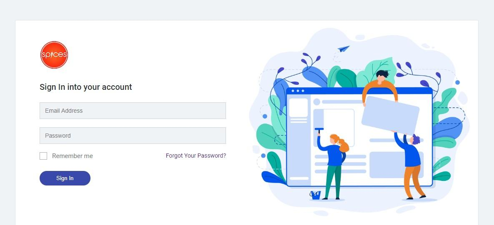
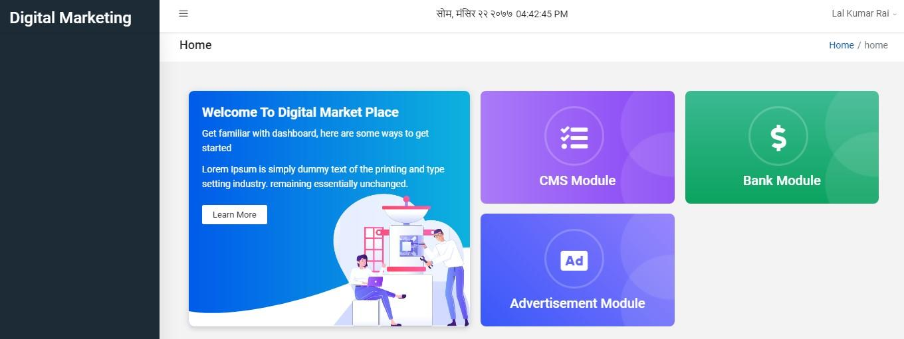

Digital Marketing Overview
=============================

It is a web-application software implemented to:

* Enable the user to create and manage contents which is to be displayed in thefrontend of the application.
* Enable the user to manage loan details with its associated sector and sector types.
* Enable the user to manage advertisement of the client.

Accessing Digital Marketing Application
----------------------------------------

* Recommended Browser: Google Chrome(Latest Version)
* Only registered/verified users can access the system.

Digital Marketing System consists of three modules. They are:

* CMS Module
* Bank Module
* Advertisement Module

Before entering into any module, user has to sign-in to the system. Sign In page looks like this:

To sign-in to the system, the user has to enter his/her valid email address and password. He/she can also check remember me box but it is optional. Then user can simply click on Sign In button.

Now the user can enter into any of these three modules and make changes there. We will be discussing how to operate each modules one by one with their sections and sub-sections.

